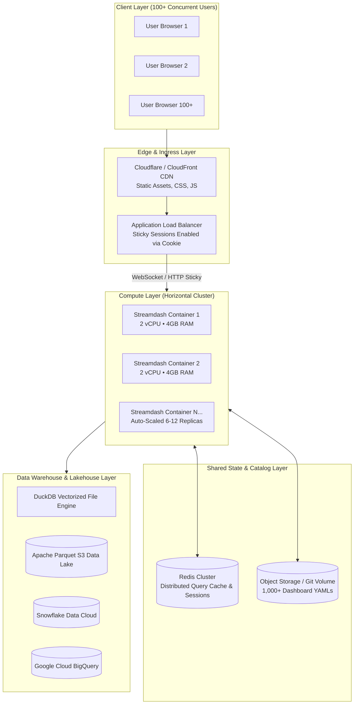
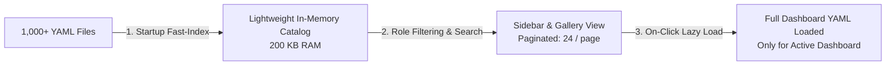
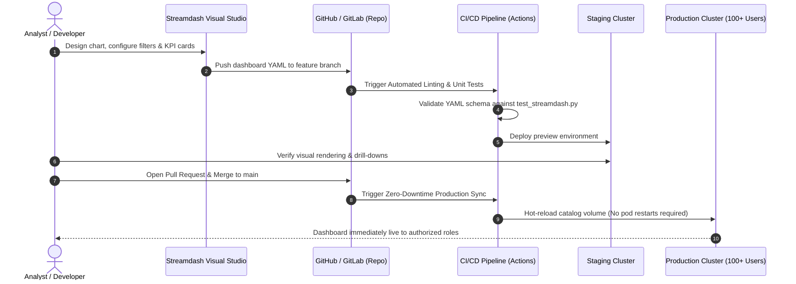

# Streamdash Enterprise Architecture & Scale-Out Guide
**Target: 100+ Concurrent Active Users • 1,000+ Declarative Dashboards**

---

## 1. Executive Summary

Streamdash is uniquely suited for massive enterprise scale because of its **declarative YAML architecture**:
- Dashboards are lightweight configuration files (~2 KB each), not heavy Python codebases.
- The core engine is stateless: rendering components are separated from data storage and warehouse computation.
- Data queries are delegated to high-performance engines (DuckDB, Parquet, Snowflake, BigQuery) rather than raw Python memory.

This blueprint details how to scale Streamdash to support **100+ simultaneous concurrent users** and **1,000+ dynamic dashboards** with sub-second response times, enterprise security, and a GitOps development workflow.

---

## 2. High-Level System Architecture



---

## 3. Scaling to 1,000+ Dashboards

### The Challenge
Scanning and parsing 1,000 YAML files from disk on every page refresh causes file-descriptor exhaustion, disk I/O bottlenecks, and DOM bloat in the browser.

### The Solution: 3-Tier Catalog Architecture



#### 1. Two-Pass Metadata Manifest (Lazy Loading)
- **Pass 1 (Catalog Indexing)**: At boot, scan only the header attributes (`id`, `title`, `category`, `icon`, `roles`, `sort_order`) of each dashboard without parsing chart queries or data blocks. For 1,000 dashboards, this manifest takes **< 250 KB of RAM** and builds in **under 80ms**.
- **Pass 2 (On-Demand Parse)**: Only when a user clicks a dashboard is the full YAML parsed into the active `DashboardRenderer`.

#### 2. Gallery Pagination & Search Indexing
- The Gallery UI (`views/home.py`) uses client-side or server-side pagination (e.g. 24 dashboards per page) with real-time text indexing across `title`, `description`, and `category`.
- The Sidebar shows **Recent Dashboards** (last 8 accessed by user) plus a modal search bar to prevent rendering 1,000 DOM buttons.

#### 3. Shared Catalog Storage
- Store dashboard YAMLs on a shared network file mount (AWS EFS, GCP Cloud Filestore) or sync automatically from an S3/GCS bucket or Git repository.

---

## 4. Scaling to 100+ Concurrent Active Users

### Streamlit Concurrency Realities
- Streamlit runs in Python's asyncio event loop with a thread-pool for script execution.
- A single Streamlit process handles **15 to 25 active concurrent users** before Python GIL contention and memory locks degrade interactive latency.
- **Formula for 100+ Concurrent Users**:
  $$\text{Replicas} = \frac{100\text{ concurrent users}}{15\text{ users/container}} \approx 7 \text{ to } 10 \text{ containers}$$

### Deployment Topology
- **Container Sizing**: 2 vCPU, 4 GB RAM per container.
- **Autoscaling Policy**: Scale based on CPU utilization (> 65%) or active WebSocket connection count:
  - Minimum replicas: 6
  - Maximum replicas: 15
- **Sticky Sessions (MANDATORY)**:
  - Streamlit requires persistent WebSocket connections.
  - The Load Balancer (ALB / Ingress-NGINX / Cloud Run) **must enable Cookie-Based Session Stickiness** (`affinity-cookie`, TTL 12 hours).

```nginx
# Example NGINX Ingress configuration for Streamdash
apiVersion: networking.k8s.io/v1
kind: Ingress
metadata:
  name: streamdash-ingress
  annotations:
    nginx.ingress.kubernetes.io/affinity: "cookie"
    nginx.ingress.kubernetes.io/session-cookie-name: "streamdash_route"
    nginx.ingress.kubernetes.io/session-cookie-expires: "43200"
    nginx.ingress.kubernetes.io/websocket-services: "streamdash-service"
    nginx.ingress.kubernetes.io/proxy-read-timeout: "3600"
    nginx.ingress.kubernetes.io/proxy-send-timeout: "3600"
```

---

## 5. High-Performance Caching Architecture

| Caching Layer | Technology | Lifetime | Purpose |
| :--- | :--- | :--- | :--- |
| **Layer 1: Browser** | HTTP Cache / ServiceWorker | 7 days | Static CSS, JS, Fonts, Brand Logos |
| **Layer 2: Local Memory** | `@st.cache_data` | 10–60 min | In-container query results & computed Plotly specs |
| **Layer 3: Distributed Cache** | Redis Cluster | 2–24 hours | Pre-aggregated cross-user metrics, dataset schemas |
| **Layer 4: Data Engine Cache** | Snowflake / BigQuery / DuckDB | Native | Warehouse query result reuse (zero warehouse credit burn) |

---

## 6. Development Workflow (GitOps Lifecycle)



### Key Principles:
1. **Zero-Code Contributions**: Business analysts create dashboards via the **Visual Builder** and save directly to YAML.
2. **Automated CI Validation**: `python tests/test_streamdash.py` runs on every Pull Request, validating:
   - Valid YAML syntax and mandatory fields (`id`, `title`, `data_source`).
   - Data adapter connectivity and schema compatibility.
   - User role permissions.
3. **Zero-Downtime Publishing**: Because configurations are loaded dynamically, new dashboards go live instantly without restarting Streamlit servers.

---

## 7. Recommended Production Tech Stack Matrix

Choose the architecture that matches your enterprise cloud strategy:

| Component | ❄️ Azure + Snowflake (Recommended) | 🔷 Pure Azure | 🌐 Google Cloud (GCP) | 🟧 Amazon Web Services (AWS) | 🐧 100% Open Source / On-Prem |
| :--- | :--- | :--- | :--- | :--- | :--- |
| **Container Hosting** | Azure Container Apps (ACA) / AKS | Azure App Service / Container Apps | Google Cloud Run / GKE | AWS ECS Fargate / EKS | Docker Compose / K3s / Vanilla K8s |
| **Ingress & Load Balancer** | Azure Application Gateway (Cookie Affinity) | Azure Front Door / App Gateway | Cloud Load Balancing (Session Affinity) | AWS Application Load Balancer (ALB) | NGINX / Traefik (Sticky Cookies) |
| **Data Warehouse / Engine** | **Snowflake Data Cloud** (Azure Hosted) | Azure Synapse / Microsoft Fabric | **Google BigQuery** | Amazon Redshift / Athena | **DuckDB** / ClickHouse |
| **Data Lake Storage** | Azure Data Lake Storage Gen2 (ADLS) | ADLS Gen2 / Blob Storage | Google Cloud Storage (GCS) | Amazon S3 | MinIO / Ceph |
| **Distributed Cache** | Azure Cache for Redis | Azure Cache for Redis | Memorystore for Redis | AWS ElastiCache for Redis | KeyDB / Redis OSS |
| **Dashboard Catalog Sync** | Azure Files (SMB/NFS) or Git Sync | Azure Files / Blob Fuse | Cloud Storage FUSE / Git Sync | Amazon EFS / S3 Mountpoint | Persistent Volume Claim (PVC) / Git |
| **Authentication & SSO** | Microsoft Entra ID (Azure AD) | Microsoft Entra ID (Azure AD) | Google Cloud Identity / Okta | AWS IAM Identity Center / Okta | Authentik / Keycloak (OIDC/SAML) |
| **CI/CD & GitOps** | GitHub Actions / Azure DevOps | Azure DevOps / GitHub Actions | Cloud Build / GitHub Actions | AWS CodePipeline / GitHub Actions | GitLab CI / ArgoCD |
| **Estimated Cost Profile** | Consumption-based warehouse + serverless containers | Consumption-based Synapse | Pay-per-query BigQuery + serverless | Reserved/On-demand Redshift | Infrastructure only (Zero license fees) |

---

### Deep-Dive: Option Architectures

#### 1. ❄️ Azure + Snowflake (Enterprise Default)
- **Container Layer**: Azure Container Apps (ACA) with Dapr sidecars or AKS. Replicas auto-scale from 6 to 12 based on HTTP concurrent requests.
- **Compute Offload**: Snowflake absorbs all compute-heavy aggregations. Streamdash instances only handle lightweight Plotly JSON generation.
- **Network**: Private Link between Azure VNet and Snowflake Virtual Private Snowflake (VPS) for zero public internet data transit.

#### 2. 🔷 Pure Azure
- **Compute**: Azure Container Apps or Azure App Service (Linux containers).
- **Data Engine**: Microsoft Fabric Lakehouse or Azure Synapse SQL Serverless querying Parquet delta tables directly on ADLS Gen2.
- **Identity**: Microsoft Entra ID (Azure AD) seamless single sign-on via OAuth2/OIDC.

#### 3. 🌐 Google Cloud Platform (GCP)
- **Compute**: Google Cloud Run with concurrency limit set to 20 requests per container and session affinity enabled.
- **Data Engine**: Google BigQuery with `@st.cache_data` and PyArrow storage API for high-speed streaming reads.
- **Storage**: GCS bucket synced via Cloud Storage FUSE.

#### 4. 🟧 Amazon Web Services (AWS)
- **Compute**: AWS ECS Fargate with Application Load Balancer (ALB) sticky sessions (`AWSALB` cookie).
- **Data Engine**: Amazon Athena querying Parquet data lakes in S3, or Redshift Serverless for real-time analytics.
- **File Sync**: AWS EFS mount directly onto ECS task definitions.

#### 5. 🐧 100% Open Source / Self-Hosted (Zero Cloud Spend)
- **Compute**: K3s or Docker Swarm running on on-premise hardware or bare-metal VMs (e.g. Hetzner, Equinix).
- **Data Engine**: DuckDB for local datasets and ClickHouse for multi-billion row cluster queries.
- **Storage & Cache**: MinIO S3-compatible storage with KeyDB (multi-threaded Redis replacement).
- **Identity**: Self-hosted Keycloak or Authentik providing RBAC.


---

## 8. Summary Checklist for 100+ Users & 1,000+ Dashboards

- [x] **Recent Dashboards Tracking**: Sidebar displays user's 8 most recent dashboards with search modal.
- [x] **PyArrow & Parquet Acceleration**: Sub-50ms reads on compressed datasets.
- [x] **Vectorized Pushdown**: DuckDB, Snowflake, and BigQuery execute compute out-of-core.
- [ ] **Sticky Sessions Configured**: Ensure ALB / NGINX routes WebSocket connections to the same container.
- [ ] **Horizontal Pod Autoscaling**: Min 6, Max 15 replicas based on CPU & WebSocket connections.
- [ ] **GitOps Sync**: Automated webhook or volume mount to sync `dashboards/*.yml` into production containers.
